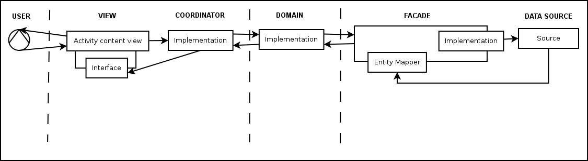

# Setup for contributions

Once cloned, just setup the hooks:

```shell
$<project-dir>: ./hooks/setup
```

# Build instructions

* Make sure you're passing a property to gradle (like through `gradle.properties`) keyed 
`FirebaseServiceAccountFilePath`. Its value is irrelevant.
* Place the Firebase service account file, named 
`master-slave-clean-store-firebase-crashreporting-private-key.json`, under the project root.
* Put your `google-services.json` files under the `debug` and `release` folders of the `app` module.

# Architecture
This is a reactive app: it runs by reacting to user interactions. Here
is how:


# Language choice
I chose Kotlin over Java because:
* It compiles to Java bytecode.
* It is less verbose than Java.
* It is more natural both to read and write, which makes
writing code easier and faster while still allowing Java developers
who have never seen it to understand it.

# Documentation
Documentation is generated using [Dokka](https://github.com/Kotlin/dokka), which is the
code documentation generation tool for Kotlin, similar to what Javadoc is for Java.
`index.html` for the documentation of each module can be found in their `build` directories:
 `module_name/build/dokka/module_name/index.html`.

# Tests
 Unit and integration tests are written using [Spek](https://spekframework.org), the specification
 framework for Kotlin. Run them with the `test` Gradle task in each module.
 Instrumentation tests are only present in the `app` module and can be run using the `cAT` task.
